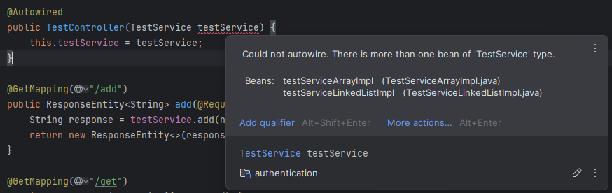

# Qualifier Annotation in Spring Boot

> [!Note]
> Pre-requisites for this is Autowiring and Interface

Let's say you are coding to interface in a spring boot project, as a part of which there are two implementations of a 
particular service interface. For real world example consider this as versioning your RestAPIs.
For demonstration purpose things are kept simpler here. Consider this `TestService` interface

```java
public interface TestService {
    String add(String name);
    String[] getAll();
}
```

And you are providing two different implementations for it namely `TestServiceArrayImpl` and `TestServiceLinkedListImpl`
of course there's no need to understand the logical implementation of those methods.

**Array Implementation**

```java
import org.springframework.stereotype.Service;

@Service(value = "TestServiceArray")
public class TestServiceArrayImpl implements TestService {

    private final String[] tests;
    private int index = 0;

    public TestServiceArrayImpl() {
        tests = new String[10];
    }

    @Override
    public String add(String name) {
        if (index >= 10) {
            return "We are not accepting new tests anymore";
        }

        tests[index++] = name;
        return String.format("%s added successfully", name);
    }

    @Override
    public String[] getAll() {
        return tests;
    }

}
```

**Linked List Implementation**

```java
@Service(value = "TestServiceLinkedList")
public class TestServiceLinkedListImpl implements TestService {

    private TestNode headNode;
    private int size = 0;

    @Override
    public String add(String name) {
        size++;
        if (headNode == null) {
            headNode = new TestNode(name);
            return name + " added successfully";
        }
        TestNode tempNode = headNode;
        while (tempNode.next != null) {
            tempNode = tempNode.next;
        }
        tempNode.next = new TestNode(name);
        return name + " added successfully";
    }

    @Override
    public String[] getAll() {
        String[] tests = new String[size];
        TestNode tempNode = headNode;
        int index = 0;

        while (tempNode != null) {
            tests[index] = tempNode.data;
            tempNode = tempNode.next;
            index++;
        }

        return tests;
    }

    private static class TestNode {
        public String data;
        public TestNode next;

        public TestNode(String data) {
            this.data = data;
            this.next = null;
        }

        public TestNode(String data, TestNode next) {
            this.data = data;
            this.next = next;
        }
    }
}
```

Now in a controller class, if the `TestService` bean is being injected via `@Autowired` annotation, spring gets confused
which object (bean) to be added here.

This is where `@Qualifier` annotation comes into picture. Text book definition says "The `@Qualifier` annotation is used
in Spring to resolve ambiguity when multiple beans of the same type exist."



Also, this is the part where a better understanding of autowiring helps. The IDE says "Could not autowire. There is more
than one bean of 'TestService' type". So the autowire first tries to resolve dependencies by type (through Spring 
Autowiring `byType` mechanism). Since that fails we have to tell spring to use this particular implementation  using the
`@Qualifier` annotation

```java
import com.example.authentication.service.TestService;
import org.springframework.beans.factory.annotation.Autowired;
import org.springframework.beans.factory.annotation.Qualifier;
import org.springframework.web.bind.annotation.RequestMapping;
import org.springframework.web.bind.annotation.RestController;

@RestController
@RequestMapping("/tests")
public class TestController {
    private final TestService testService;

    @Autowired
    public TestController(
            @Qualifier("TestServiceLinkedList") TestService testService
    ) {
        this.testService = testService;
    }
}
```

If you observe the `TestService` implementation classes a value field is passed to the `@Service` annotation which is 
then passed to the Qualifier to specify which bean should be used.

> [!Note]
> Things are simplified here for demonstration in Spring Boot.
> For in-depth understanding of how this works in Spring Framework refer [Spring Qualifier Annotation](https://www.geeksforgeeks.org/spring-qualifier-annotation-with-example) by Geeks for Geeks